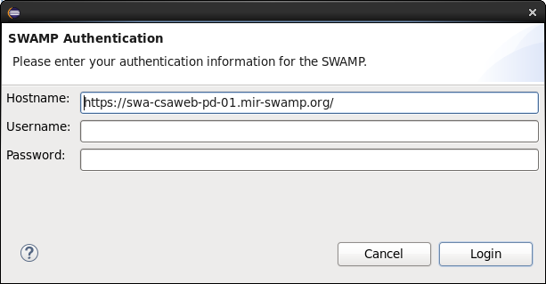
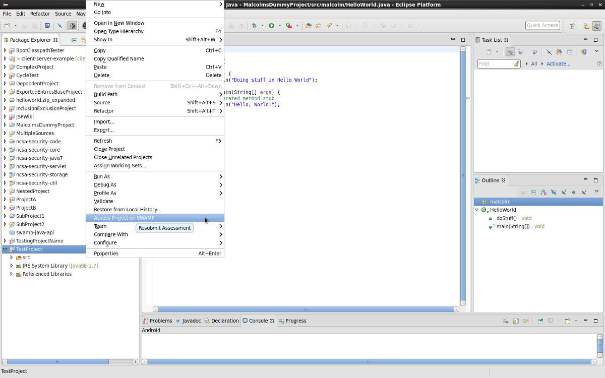
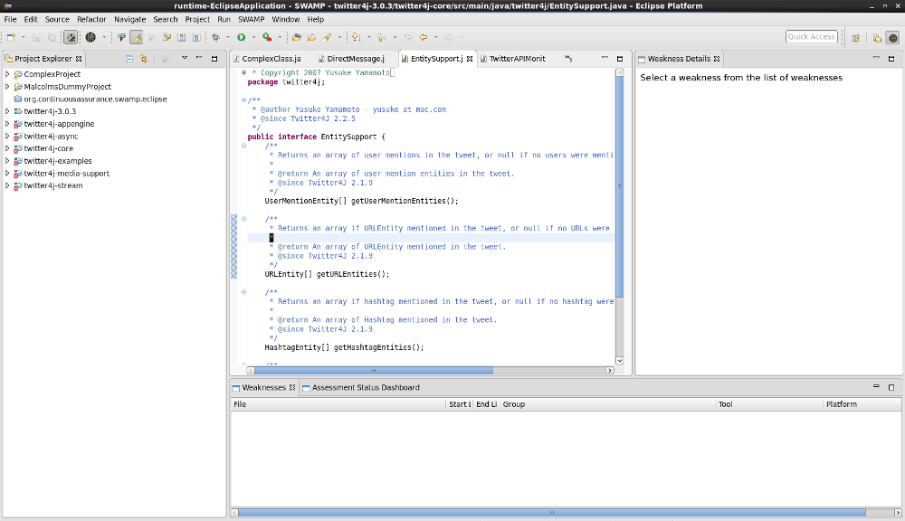
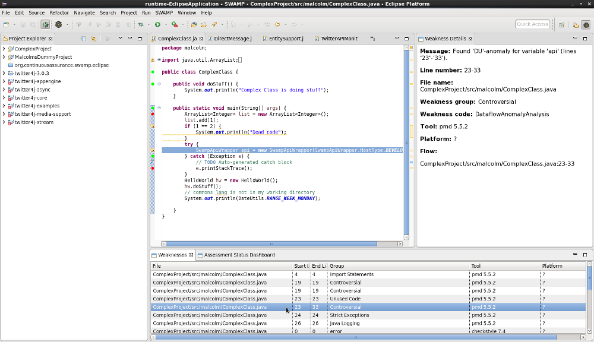

== `SWAMP Eclipse Plug-in User Guide`

**March 12, 2017** +
**Authors:** __Malcolm Reid Jr., James A. Kupsch__ +

This document describes the SWAMP Eclipse plug-in, an extension to the Eclipse IDE that allows users with SWAMP accounts to submit Java code to the SWAMP. Working with the plug-in involves the following steps:

    . <<appendix-a, Get a SWAMP account (see Appendix A)>>
	. <<appendix-b, Install Eclipse (see Appendix B)>>
	. <<plug-in-installation, Install the plug-in>>
    . <<plug-in-config, Set up plug-in preferences (optional)>>
	. <<configuration-and-submission, Configure and submit package assessments>>
    . <<view-results, View assessment results>>

:numbered:

[[overview]]
== **overview**
The Software Assurance Marketplace (SWAMP) hosts a collection of static analysis tools, which look for security vulnerabilities and other bugs in source code. A user can upload code to the SWAMP and get results from having that code assessed on different tools and operating systems. The purpose of this plug-in is to allow users to submit code quickly and easily from the Eclipse Integrated Development Environment.

[[plug-in-installation]]
== **plug-in installation**
To install the Eclipse plug-in, a user may either download the plug-in archive and import it into Eclipse or download the plug-in directly from the Eclipse Marketplace.

=== **import plug-in**
To import, follow these steps:

	. Download the archive from the SWAMP releases page and unzip it.
    . Open Eclipse Neon (or any version after it).
    . In the menu bar, select "Help > Install New Software".
    . In the "Install" dialog that comes up, click "Add...".
    . In the "Add Repository" dialog that comes up select "Local..." and select the directory created from unzipping the archive.
    . Back in the "Install" dialog, uncheck the "Group items by category" checkbox. The Eclipse plug-in should show up as an option now. Check that checkbox.
    . Click "Next" and finish the installation. Eclipse will restart and when it reopens, the plug-in should be installed

=== **Eclipse Marketplace**
The Eclipse Marketplace hosts plug-ins and features. To access the Eclipse Marketplace, select "Eclipse Marketplace..." from the Help menu. Search for "SWAMP" and click the install button. When the installation is finished, you should see the SWAMP icon in the toolbar and the SWAMP menu in the menubar.

image:images/menuAndToolbar.png[Menubar and Toolbar, 600, 600]

[[plug-in-config]]
== **set up plug-in preferences (optional)**
=== **available SWAMP hosts**
For shared Eclipse installations and individual installations, system administrators and users may control what SWAMP hosts are accessible by modifying SWAMP_hosts.json and adding it to the installation directory (see Eclipse's Platform.getInstallLocation() for more details). By default, the MIR host is available to all users.

=== **editor markers**
The SWAMP perspective adds colored markers to the left-hand ruler to annotate weaknesses found by the SWAMP. A user may set preferences for these markers by modifying .marker_preferences and moving it to a directory named .SWAMP_SETTINGS in the user's home directory.

[[configuration-and-submission]]
== **configuration and submission**

=== **login**
A user must be logged into his or her SWAMP account to use the plug-in. To log in, select "Log In" from the SWAMP dropdown menu. The hostname field specifies what SWAMP instance a user logs into. By default, the Morgridge Institute for Research's hostname is entered. The next two fields are username and password. If logging onto the default SWAMP instance, these are the same credentials used for www.mir-swamp.org. The plug-in stores cookies with the user's session information for 24 hours. To log out, select "Log Out" from the SWAMP dropdown menu.

=== **assessment configuration**

Any of the open Java projects in a user's Eclipse workspace may be submitted to the SWAMP. To configure a project, a user simply needs to have some file from the project (e.g. a source code file) active in his or her editor and to select "Configure Assessment Submission" from the SWAMP dropdown menu. If the user is not logged in, the authentication popup will come first allowing the user to authenticate. Once the user is logged in, a dialog with configuration information for the assessment pops up.

image:images/BuildConfiguration.png[Configuration Dialog]

=== **configuration options**
	a. *SWAMP Project* - this is the SWAMP project to which the package belongs (or if it's a new package, the project to which the package will be added). A user can only select from projects he or she has access to
	b. *SWAMP Package* - this is the SWAMP package of which a version will be uploaded. This also offers the option to "Create new package"
	c. *New Package Name* - this is the name of the new package that will be uploaded
	d. *Package Version* - this is the version of the package that will be uploaded. It defaults to a timestamp of the time at which this dialog was opened
	e. *Eclipse Project* - this is the Java project in the user's workspace whose source will be uploaded
	f. *Package Type* - this is the SWAMP package type of the package. A user may think of the package type as the language version. The valid package types for the Eclipse plug-in are "Java 7, Java 8, and C/C++." In most cases, this will be set automatically based on how the Eclipse project to be assessed is configured.
	g. *Build System* - this is the build system of the project. If a user selects "Auto-generate build file", the plug-in will create a build file for building the project.
	h. *Package System Libraries?* - this option allows users to upload the system libraries that Eclipse uses for this project to the SWAMP along with the package. This sets the bootclasspath for the Java compiler. In most cases, this should not be checked as uploading system libraries is time consuming and only provides benefits in certain cases. If a project builds in Eclipse but fails to build in the SWAMP, a user should try uploading system libraries.
	i. *Build File* - this is the path of the build file to be used (in the case that the plug-in is not auto-generating the build file)
	j. *Build Target* - this is the target to build the project (in the case that the plug-in is not auto-generating the build file)

=== **tool selection**
Next, a user must select the tools he or she wishes to run the assessments on

image:images/ToolDialog.png[Tool Dialog]

=== **platform selection**
Finally, a user must select the platforms he or she wishes to run the assessments on. A platform is the operating system that runs on an assessment's virtual machine. For interpreted languages or languages that run on a VM there will only be one option.

image:images/PlatformDialog.png[Platform Dialog]

=== **submission**

After a user clicks "OK" in the dialog for selecting platforms, a background job is launched. The user's console will have messages from the plug-in's execution.

The plug-in saves previous assessment information about each Eclipse project. Instead of using the configuration dialogs, a user may resubmit an assessment in one of three ways:
	1. Have a file from the project open in the editor and click the SWAMP button
	2. Right-click on the project on Package Explorer and click "Assess Project on SWAMP"
	3. Have a file from the project open and select "Resubmit Previous Assessment" from either the dropdown menu or the SWAMP menu in the main menubar

[[view-results]]
== **View assessment results**

This plug-in comes with a new perspective named "SWAMP." When a user opens the SWAMP perspective, he or she will see an editor and four views: the package explorer, the weakness table view, the assessment status view, and the weakness detail view. 

=== **view assessment statuses**
The assessment status view shows the status of submitted assessments. The statuses are periodically updated automatically, but the user may click the "Refresh" button any time to query the SWAMP for unfinished assessments' statuses. By right-clicking and selecting "Remove Assessment" on an unfinished assessment, the status of that assessment will no longer appear in the view. Selecting "Remove Assessment" on a finished assessment, will both remove that status row and stop the results from showing on top of the source code in the Eclipse editor.

=== **view results**
To view results for a finished assessment, the user must open the source code for the Eclipse project that was assessed. If any weaknesses were found on the currently opened source file, they will show up with annotated markers on the editor and listed in the weakness table view. Single-clicking any weakness in the table view will show more detailed information about the weakness in the weakness detail view. Double-clicking any weakness in the table view, will jump the user to that weakness'es location in the source file.

[[appendix-a]]
== **Appendix A: SWAMP account setup**
A user must have a SWAMP account to use this plug-in. To set up an account, follow the instructions at https://www.mir-swamp.org/.

[[appendix-b]]
== **Appendix B: Eclipse Installation**
This plugin requires Eclipse Neon (4.6) or later to run. To install Eclipse, select either Eclipse IDE for Java EE Developers or Eclipse IDE for Java Developers from https://eclipse.org/downloads/eclipse-packages/.
